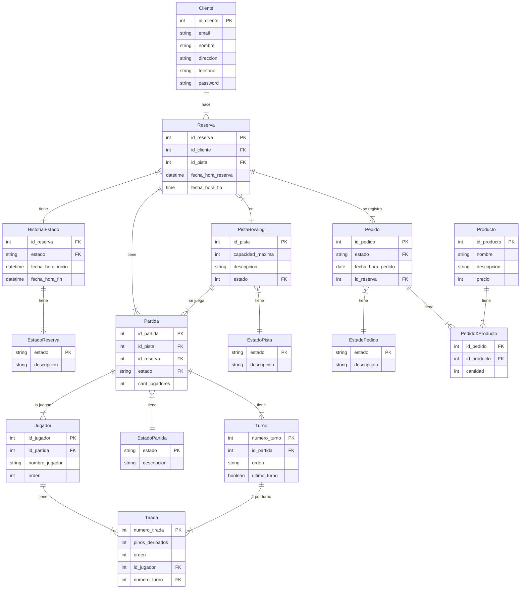

```mermaid
      classDiagram
    direction TB


    
    class ClienteManager {
    <<Handler>>
        +create_user()
        +create_superuser()
    }

     class TablaView {
        <<interfaz>>
    
    
        +get_context_data()
        +get_partida()
        +get_jugadores()
        +get_Tiradas()
        +get_turnos()
        +get_turno_actual()
        +post()
        +registrar_tirada()
        +termino_la_partida()
        +finalizar_partida()
    }


    class Cliente {
        +id_cliente: AutoField
        +email: EmailField
        +nombre: CharField
        +direccion: CharField
        +telefono: CharField
        +password: CharField
        +is_staff: BooleanField
        +is_active: BooleanField
        +is_superuser: BooleanField
        
    }


    class Pedido {
        +id_pedido: AutoField
        +estado: ForeignKey
        +fecha_hora_pedido: DateField
        +id_reserva: ForeignKey
        +total_a_pagar: property
        +crear_pedido()
    }   

    class PistaBowling {
        +id_pista: AutoField
        +capacidad_maxima: IntegerField
        +descripcion: CharField
        +estado: ForeignKey
    }

    class Reserva {
        +id_reserva: AutoField
        +id_cliente: ForeignKey
        +id_pista: ForeignKey
        +fecha_hora_reserva: DateTimeField
        +fecha_hora_fin: TimeField
        +save()
        +crear_historial_estado_inicial()
        +procesar_reserva()
        +actualizar_ultimo_estado()
        +verificar_confirmacion()
        +verificar_estado_actual()
        +verificar_finalizacion()
        +actualizar_fecha_hora_fin()
        +crear_historial_estado()
        +finalizar()
        +estado_actual: property
    }

    class HistorialEstado {
        +id_reserva: ForeignKey
        +estado: ForeignKey
        +fecha_hora_inicio: DateTimeField
        +fecha_hora_fin: DateTimeField
    }

    class EstadoReserva {
        +estado: CharField
        +descripcion: CharField
    }

    class Jugador {
        +id_jugador: AutoField
        +id_partida: ForeignKey
        +nombre_jugador: CharField
        +orden: IntegerField
        +puntaje_total: property
    }

    class Partida {
        +id_partida: AutoField
        +id_pista: ForeignKey
        +id_reserva: ForeignKey
        +estado: ForeignKey
        +cant_jugadores: IntegerField
        +ganador: ForeignKey
        +actualizar_estado()
        +crear_partidas_para_reserva()
        +actualizar_estado_partida()
        +calcular_ganador()
        +get_current_turn()
        +is_game_finished()
        +finalize_game()
        +crear_turnos()
        +iniciar_partida()
    }

    class EstadoPartida {
        +estado: CharField
        +descripcion: CharField
    }

    class Turno {
        +numero_turno: AutoField
        +id_partida: ForeignKey
        +orden: CharField
        +ultimo_turno: BooleanField
    }

    class Tirada {
        +numero_tirada: AutoField
        +pinos_deribados: IntegerField
        +orden: IntegerField
        +id_jugador: ForeignKey
        +numero_turno: ForeignKey
        +registrar_tirada()
    }

    class EstadoPista {
        +estado: CharField
        +descripcion: CharField
    }


    class EstadoPedido {
        +estado: CharField
        +descripcion: CharField
    }

    class PedidoXProducto {
        +id_pedido: ForeignKey
        +id_producto: ForeignKey
        +cantidad: IntegerField
    }

    class Producto {
        +id_producto: AutoField
        +nombre: CharField
        +descripcion: CharField
        +precio: IntegerField
    }

    

    class MisReservasView {
        <<interfaz>>

        +reserva: Reserva
        +get_reservas()
        +procesar_reserva()
    }

    class mi_reservaView {
        <<interfaz>>

        +reserva: Reserva
        +crear_partidas_para_reserva()
        +actualizar_estado_partida()
        +get_pedidos()
        +get_reservas()
        +get_partidas()
        +get_estado_reserva()
        +calc_total_a_pagar()
        +finalzar_reserva()
    }

   
    class ReservaView {
        <<interfaz>>
    
        +reserva: Reserva
        +get_form_kwargs()
        +form_valid()
        +save_reserva()
    }

    class JugadoresView {
        <<interfaz>>
    
        +jugadores: Jugador[ ]
        +get()
        +post()
        +save_partida()
        +get_detalles_pista()
    }

    class NombresJugadoresView {
        <<interfaz>>
    
        +jugadores: Jugador[ ]
        +get()
        +post()
        +isinstance()
        +get_object_or_404()
        +crear_turnos()
        +iniciar_partida()
        +crear_Jugador()
        +iniciar_partida()
    }

    class AgregarPedidoView {
        <<interfaz>>
    
        +pedido: Pedido
        +post()
        +get_object_or_404()
        +crear_pedido()
    }

    
    class VerReservasView {
        <<interfaz>>

        +reserva: Reserva
        +get_queryset()
        +get_context_data()
        +test_func()
    }

    class EditarReservaView {
        <<interfaz>>

        +reserva: Reserva
        +get_context_data()
        +form_valid()
        +test_func()
    }

    class VerPedidosView {
        <<interfaz>>

        +pedido: Pedido
        +get_queryset()
        +get_context_data()
        +test_func()
    }

    class EditarPedidoView {
        <<interfaz>>

        +pedido: Pedido
        +get_context_data()
        +form_valid()
        +test_func()
    }

    class EliminarPedidoView {
        <<interfaz>>

        +pedido: Pedido
        +get_object()
        +delete()
        +test_func()
    }

    class VerPistasView {
        <<interfaz>>

        +pista: PistaBowling
        +get_queryset()
        +test_func()
    }

    class EditarPistaView {
        <<interfaz>>

        +pista: PistaBowling
        +get_context_data()
        +form_valid()
        +test_func()
    }

    note for AgregarPedidoView "Para hacer pedidos"

    note for NombresJugadoresView "Para poner los Nombres
    de los Jugadores"

    note for JugadoresView "Para colocar la CANTIDAD de jugadores"

    note for ReservaView "Esta vista es para hacer la reserva"

    note for TablaView "La vista que muestra y genera la tabla"

    note for mi_reservaView "Para cuando ingresas a ver detalles 
    de una de TUS reservas"

    note for MisReservasView "Para visualizar las 
    reservas que hiciste"


    
    
    
    

    

    AgregarPedidoView -- Pedido
    VerPedidosView -- Pedido
    EditarPedidoView -- Pedido
    EliminarPedidoView -- Pedido
    mi_reservaView -- Pedido
    

    

    
    
    

    

    

    NombresJugadoresView -- Jugador
    NombresJugadoresView -- Turno


    JugadoresView -- Jugador


    HistorialEstado --> "*" EstadoReserva

    Pedido --> "1" EstadoPedido
    Pedido -- "1" PedidoXProducto
    PedidoXProducto  --> "*" Producto

    

    Partida --> "*" Jugador
    Partida --> "*" Turno
    Partida --> "1" EstadoPartida

    Jugador --> "*" Tirada

    Turno --> "*" Tirada

    
    TablaView -- Jugador
    TablaView -- Tirada
    TablaView -- Turno

    NombresJugadoresView -- Partida
    TablaView -- Partida
    mi_reservaView -- Partida
    Reserva --> "*" Partida

    VerPistasView -- PistaBowling
    EditarPistaView -- PistaBowling
    PistaBowling --> "1" Partida
    PistaBowling --> "1" EstadoPista
    
    
    


    Reserva --> "*" Pedido
    
    
    Reserva  --> "1" PistaBowling
    
    Reserva --> "1" HistorialEstado
    
    mi_reservaView -- Reserva
    ReservaView -- Reserva
    MisReservasView -- Reserva
    VerReservasView -- Reserva
    EditarReservaView -- Reserva

    Cliente --> "*" Reserva
    ClienteManager -- Cliente

    note for VerReservasView "Para visualizar las reservas"

    note for EditarReservaView "Para editar una reserva"

    note for VerPedidosView "Para visualizar los pedidos"

    note for EditarPedidoView "Para editar un pedido"

    note for EliminarPedidoView "Para eliminar un pedido"

    note for VerPistasView "Para visualizar las pistas"

    note for EditarPistaView "Para editar una pista"

    

 
    
```

# Grupo 4 - Centro de Bowling

## Integrantes del Grupo:
- MARTINO, Nahuel
- PAGANI, Nicolas
- VERCELLONE, Carlos Ignacio
- ZABALA, Valentin

---

## Índice

1. [Descripción del Proyecto](#descripción-del-proyecto)
2. [Estructura del Repositorio](#estructura-del-repositorio)
3. [Requisitos Previos](#requisitos-previos)
4. [Guía de Instalación](#guía-de-instalación)
5. [Configuración de la Base de Datos](#configuración-de-la-base-de-datos)
6. [Ejecutar la Aplicación](#configura-y-ejecuta-la-aplicación)

---

## Descripción del Proyecto

Este es un proyecto Django para la gestión de un centro de bowling. La aplicación permite a los usuarios gestionar reservas, visualizar información de jugadores, y administrar puntuaciones.

---

## Estructura del Repositorio

```plaintext
├── Diagrama de Clases
│   ├── CentroDeBowling_4.mmd
│   └── CentroDeBowling_4.png
├── E-R Diagram
│   ├── CentroDeBowling_4.mmd
│   └── CentroDeBowling_4.png
├── MYSQL
│   ├── CentroDeBowling_4-mysql.sql
│   └── Centro_de_bowling.mwb
├── VENV Proyecto
│   ├── Pipfile
│   ├── Pipfile.lock
│   ├── Proyecto_Integrador
│   │   ├── config
│   │   ├── db.sql
        ├── database.json
│   │   ├── main
│   │   └── manage.py
│   └── requirements.txt
```

---

## Requisitos Previos

Asegúrate de tener instalados los siguientes componentes en tu sistema:
- Python 3.8+
- Pip
- MySQL Server
- **Pipenv (`pip install pipenv`)**

- **Para evitar futuros conflictos**
   ```bash 
      sudo apt update
      sudo apt upgrade
   ```

---

## Guía de Instalación

1. **Clona el repositorio**:
   ```bash
   git clone <URL_del_repositorio>
   cd <nombre_del_directorio>
   ```

2. **Configura el entorno virtual**:
   Navega al directorio **VENV + DJANGO** y ejecuta:
   ```bash
   pipenv install
   ```
   Esto  creará un entorno virtual y lo configurará con las dependencias especificadas.

3. **Activacion**: Cada vez que quieras activar el entorno virtual,navega hasta la carpeta donde se encuentre el venv y  ejecuta:
   ```bash
   pipenv shell
   ```


---

## Configuración de la Base de Datos


## Iniciar MySQL y Crear el Usuario

1. **Abre la terminal o símbolo del sistema**.

2. **Accede a MySQL como usuario root**:
   Cuando instalaste MySQL, debiste haber configurado una contraseña para el usuario `root`. Usa esa contraseña para acceder.

   ```bash
   sudo mysql -p
    ```

3. **Después de ejecutar este comando, se te pedirá que ingreses la contraseña de root:**

    Crea el usuario y otorga privilegios: Una vez dentro de MySQL, ejecuta los siguientes comandos uno por uno para crear el usuario y otorgarle los permisos necesarios sobre la base de datos Grupo_4_bowling:

    ```sql
    CREATE DATABASE IF NOT EXISTS Grupo_4_bowling;
    CREATE USER 'admin'@'localhost' IDENTIFIED BY 'TPI-6to-bowling';
    GRANT ALL PRIVILEGES ON Grupo_4_bowling.* TO 'admin'@'localhost';
    FLUSH PRIVILEGES;
    ```

4. **Salir de MySQL: Cuando hayas terminado, escribe exit para salir de MySQL.**

    ```sql
        exit
    ```


---

## Importar Datos al Iniciar el Proyecto

Navega primero al directorio del proyecto Django 

```bash
cd VENV\ +\ DJANGO/Proyecto_Integrador/
```

Para que los datos se carguen automáticamente, puedes añadir el siguiente comando en tu script de inicialización o en la documentación para ejecutarlo al iniciar el proyecto:

```bash
   python manage.py makemigrations
   python manage.py migrate
   ```
Django aplicara las migraciones de datos


```bash
python manage.py loaddata database.json
```

Django cargará los datos especificados en la base de datos del proyecto.


---

## Configura y ejecuta la Aplicación

1. **Datos del Usuario Administrador**:

   ```python
   email: grupo4@admin.com
   password: admin
   ```

   Es importante que recuerdes el email y password  para poder iniciar sesion como Administrador luego en la Aplicacion.


1. **Ejecuta el servidor**:

   ```bash
   python manage.py runserver
   ```

3. **Accede a la aplicación**:

   La aplicación estará disponible en [http://localhost:8000](http://localhost:8000).
---


<details>

<summary>Diagrama Entidad - Relacion </summary>



        
</details>

<details>

<summary>Diagrama UML de Clases </summary>



        
</details>
